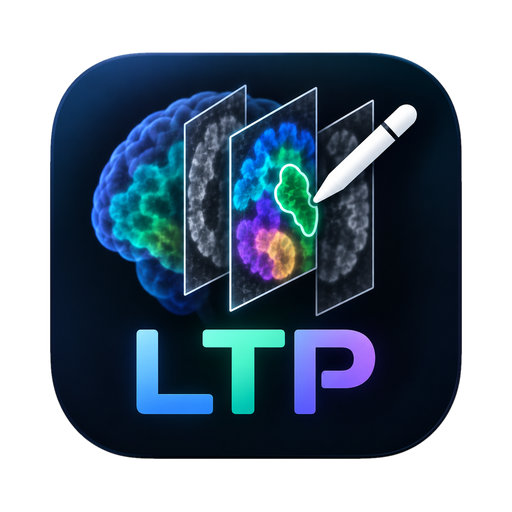

# LTP | Label, Train, Predict

LTP is a desktop application for creating training data and segmenting 3D microscopy images. Annotate regions or individual objects, train a model on your data, review predictions, and process larger image volumes using local or remote compute.

Built with napari and PyTorch, LTP brings image annotation, model training and result inspection into one workflow.

## Download

| Platform | Download | Availability |
|---|---|---|
| macOS, Apple silicon | [**Download LTP for Mac (latest)**](https://github.com/sciencehunt/LabelTrainPredict/releases/latest/download/LTP-mac.dmg) | Always the newest version. Signed and notarized for macOS 14 or newer; updates itself (a window at start-up offers new versions). [Release notes](https://github.com/sciencehunt/LabelTrainPredict/releases/latest). |
| Windows 10/11, x64 | [**Download Windows alpha**](https://github.com/sciencehunt/LabelTrainPredict/releases/download/v0.2.13-alpha.1/LTP-windows-x64-alpha-installer.zip) | Version 0.2.13 alpha.1 for testing. Includes Python, the nnInteractive helper and progressive Vulkan viewing. See the [test results and compatibility notes](https://github.com/sciencehunt/LabelTrainPredict/releases/tag/v0.2.13-alpha.1). |
| Linux, x86_64 | [**Download LTP for Linux (latest)**](https://github.com/sciencehunt/LabelTrainPredict/releases/latest/download/ltp-linux-x86_64.tar.gz) | Always the newest version, built from the same source as the Mac release. The GPU engine has been tested; desktop validation is pending. |

These links provide the current download for each platform. The Mac app offers automatic updates; Windows and Linux users can download a newer package when notified. Corresponding source archives are attached to each platform's release on the [releases page](https://github.com/sciencehunt/LabelTrainPredict/releases).

See [installation and hardware requirements](docs/GETTING_STARTED.md) before downloading. Preview releases may contain experimental features.

## Work with your images

- **Open:** TIFF/OME-TIFF, Imaris .ims, Olympus .oib/.oif and .oir, and more; images are shown at their physical voxel size with a scale bar.
- **Label:** paint regions on slices or annotate complete 3D objects. Review model suggestions before using them as training labels.
- **Train:** fit a segmentation model to your microscopy data. Advanced settings expose network structure and experimental flow, embedding and offset outputs.
- **Predict:** process images in blocks locally or on an SSH GPU workstation, then inspect saved results and create correction crops.
- **Preprocess:** even out illumination or compress contrast using a Mantiuk-inspired 3D method. Select channels, compare suggested corrections, and accept a separate output. Local GPU and SSH workstation options are available. Corrected intensities are unsuitable for fluorophore quantification; retain the original images.
- **View Output:** inspect images and predictions, and combine up to eight masks from different projects using inclusion, exclusion, union or intersection. 

Original images, manual annotations and model predictions remain separate. Unlabelled pixels are not automatically treated as background. Predictions require review before they become training data.

## Documentation

- [Install and get started](docs/GETTING_STARTED.md)
- [Annotation, training and output workflows](docs/WORKFLOWS.md)
- [Technical documentation](docs/README.md)

For a problem report, use [GitHub Issues](https://github.com/sciencehunt/LabelTrainPredict/issues) and include your operating system, app version, relevant diagnostics and reproduction steps. Share synthetic examples where possible; do not attach confidential images or credentials.

## License

LTP is distributed under the [Apache License 2.0](LICENSE). Dependencies and optional pretrained models retain their own licenses.
